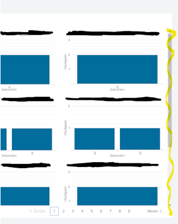
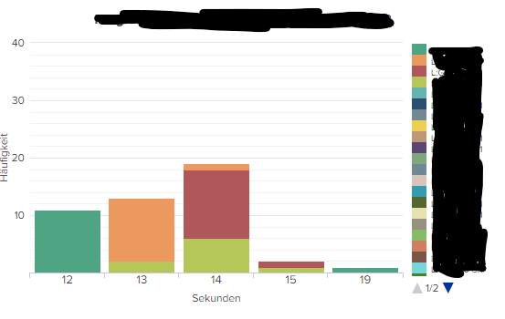
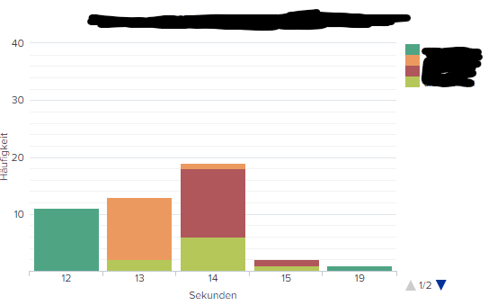

# resize_panels.js
## Why did I build it?
I guess everyone knows the situation when panels got a scroll bar as well as the pagination stuff. In some cases this can be achived by using a token which will be set to the result count of a search. Unfortunately that's not possible if you going to use trellis cause the number of charts does not align with the number of results.

## Is there a better solution?
Probably but non I was able to find.

## Could it break something?
Probably. I have tested it just for my use case.

## How to use it?
1. Include the js into your dashboard
2. Include the term `resize` into the searches you would like to trigger a resize on all panels

## Screenshots

## Examples
Take a look at `remove_unused_legends_post.xml` it's included there

# remove_unused_legends.js
## Why did I build it?
When you're using a trellis chart (I tested it with column charts) each series will be included in every legend no matter if the series is included into the chart. This could lead to huge numbers of useless legends which can be removed to keep your dashboard nice & clean.

## Is there a better solution?
None I'm aware of

## Could it break something?
It might take a while to loop through all the elements. Beside that im quite confident that the script is quite stable.

## How to use it?
1. Include the js into your dashboard
2. Include the term `remove_unused_legends` into the searches you would like to trigger a new clean up.

## Screenshots
without `remove_unused_legends.js`: 

with `remove_unused_legends.js`: 

## Examples
`remove_unused_legends_pre.xml` & `remove_unused_legends_post.xml`
